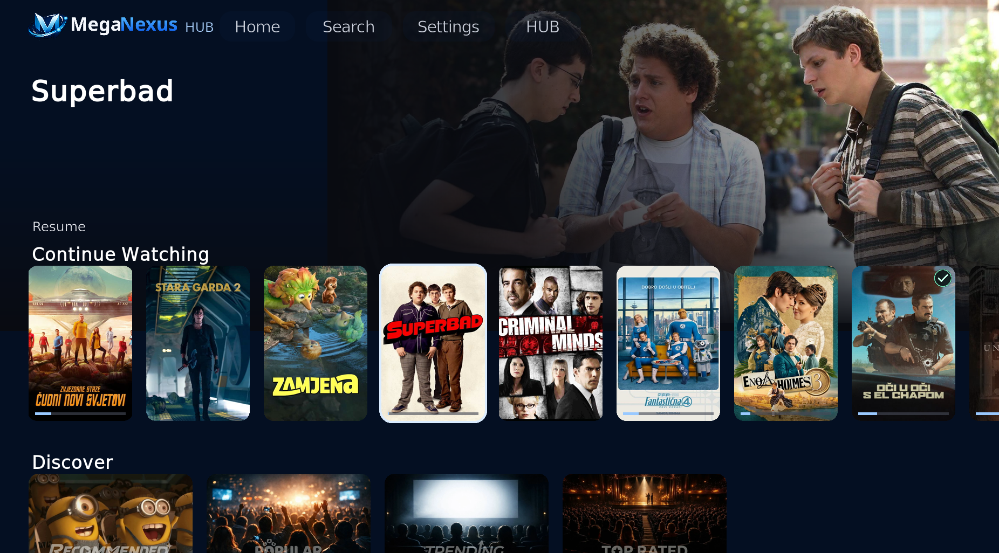
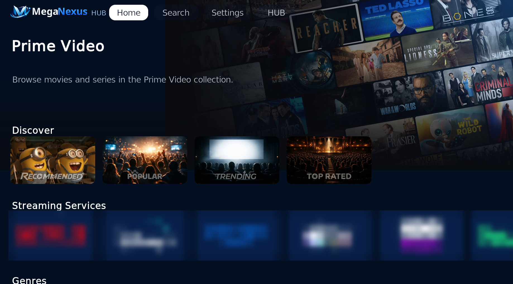
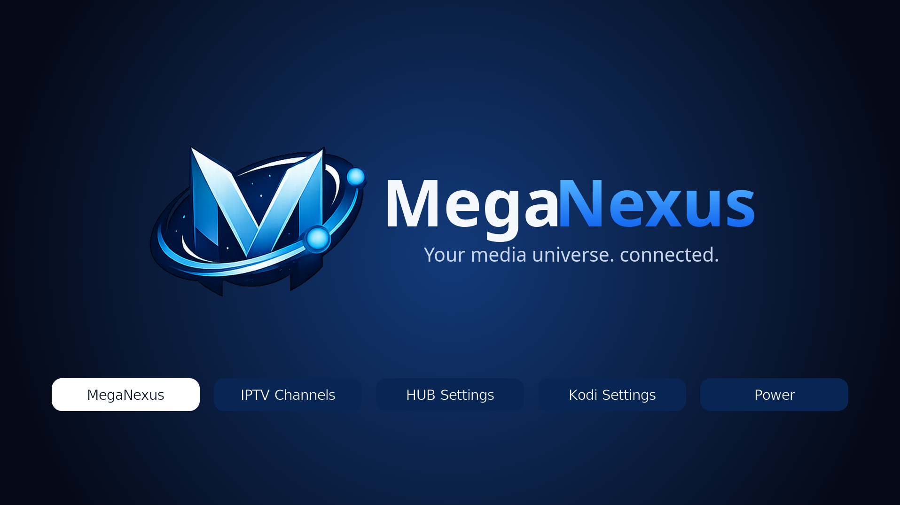
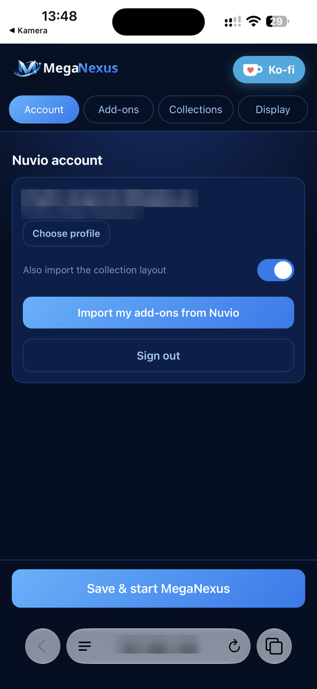
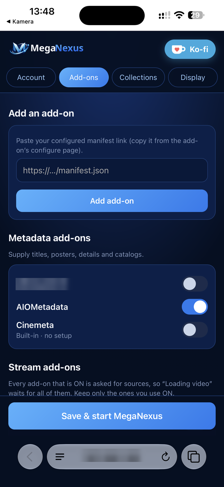

  

  
  
  
  

<b>A complete overhaul of Kodi that looks and works like a streaming app - 
the way Stremio and Nuvio do, with Kodi's player underneath.</b>

---

## What is MegaNexus?

MegaNexus replaces everything you see in Kodi - its home screen, menus, title pages, player and
screensaver - with one app built for the remote. You don't browse folders or install a different
video add-on for every site: like **Stremio** and **Nuvio**, MegaNexus is driven by **add-ons
that you add with a link** (their *manifest*). Movies, series, posters and descriptions come
from a metadata add-on; the links to play come from stream add-ons; subtitles from subtitle
add-ons.

- ✅ **Every Stremio and Nuvio add-on works:** Torrentio, AIOStreams, AIOMetadata, Comet,
  MediaFusion, Cinemeta, OpenSubtitles and the rest. Paste the same link you use in the
  Stremio or Nuvio app, or sign in and bring all of them over at once.
- 🚫 **Classic Kodi video add-ons are not needed and not recommended.** MegaNexus does not use
  them; mixing them in only slows Kodi down.
- 🎞️ **Kodi still does the playing,** so you keep what Kodi is great at: every codec, Dolby
  Vision and HDR, refresh-rate switching, CoreELEC and Android TV boxes.

MegaNexus is free for personal use. It does not host or provide any media: it plays what your own
accounts, servers and add-ons give you.

  
  
  
  
  

<a href="docs/SCREENSHOTS.md">More screenshots →</a>

## ✨ Features

**🏠 Watching**
- Home with Continue Watching, collections and catalog rows, trailers and a big picture of the title under the cursor.
- Title pages with the full description, ratings (IMDb, Rotten Tomatoes, Metacritic… via MDBList), seasons, episodes, cast and *More like this*.
- Search across all your metadata add-ons, Library, and a calendar of what you added.

**⚡ Streams**
- **TorBox direct and Premiumize direct** built in: add your key and their cached results appear next to your add-ons, no extra add-on needed.
- Fast source search: the list opens with the first results and fills in as each add-on answers; every source shows the add-on it comes from, with a filter row on top.
- Automatic stream choice that knows releases: REMUX → Blu-ray → WEB-DL, then Dolby Vision / HDR and the best audio (TrueHD Atmos, DTS-HD MA…). Autoplay moves on to the next source by itself when one does not play.
- **Downloads:** keep a film or an episode on your device or network share. Lost connection? It carries on where it stopped.

**💬 Subtitles**
- One button searches every subtitle add-on at once and lists every version.
- **Autosync subtitle offset** lines a subtitle up with your video - see below.

**▶️ Your progress everywhere**
- Sync with your **Nuvio** or **Stremio** account, **Trakt**, **Simkl** and **MDBList**: progress, watched marks and watchlists. One Continue Watching card per title, whatever app saved it.

**📺 Live TV and Sport** - IPTV (Xtream or M3U) with guide, preview and catch-up; a Sport screen for live events.

**📱 Your phone as the remote's keyboard** - set everything up by scanning a QR code, and type into any on-screen keyboard from your phone.

**🎨 Make it yours** - light, dark and dim themes, your own wallpaper and colours, a Google TV-style screensaver with clock, weather and calendar.

**🖥️ Your own media** *(beta)* - Plex, Jellyfin / Emby and local drives, offered first when you play a title.

## 💬 How Autosync subtitle offset works

A subtitle made for another release of a film starts early or late, or slowly drifts away
(for example a 25 fps subtitle on a 23.976 fps video). Press **Autosync subtitle** in the player
(next to Offset) and MegaNexus fixes it in a few seconds - **without AI and without listening to
the audio**:

1. It downloads the other subtitles of the same title from your subtitle add-ons, **in any
   language** - people speak at the same moments in every language.
2. It compares when the lines start and finds the shift and the speed difference that most of
   them agree on (a subtitle named like your stream counts more).
3. The corrected subtitle loads at once. If the other subtitles don't agree, nothing changes,
   so it never makes things worse.

It works with subtitles that come **through your subtitle add-ons (their manifests - OpenSubtitles,
AIOStreams and so on)**, not with Kodi's own subtitle services or subtitles built into the video file.
It is on by default (Playback & subtitles → Subtitles).

## 🚀 Install

**What you need:** Kodi 21 (Omega) or Kodi 22 (Piers) on Android TV / Fire TV, CoreELEC / LibreELEC,
Windows, Linux or macOS. A debrid account (TorBox, Premiumize, Real-Debrid…) is recommended for
fast streams.

**From the MegaNexus repository** (recommended - updates arrive by themselves)

1. Kodi **Settings → File manager → Add source**, enter `https://meganexusmediaplayer.github.io/MegaNexus/` and name it `MegaNexus`.
2. **Add-ons → Install from zip file → MegaNexus** and install the repository zip.
3. **Add-ons → Install from repository → MegaNexus Repository → Video add-ons → MegaNexus Hub**.
4. The interface, skin and screensaver install themselves a few seconds later. When Kodi asks to keep the MegaNexus skin, answer **Yes**.

**Or from the zip:** download **`MegaNexus-Complete-<version>.zip`** from
[Releases](https://github.com/MegaNexusMediaPlayer/MegaNexus/releases/latest) (not GitHub's
"Source code" archive) and use **Add-ons → Install from zip file**.

> [!TIP]
> Coming from the earlier build? Just update - your settings, accounts, add-ons and Continue Watching move over on their own. More in [docs/INSTALL.md](docs/INSTALL.md).

## ⚙️ First steps

1. Open **HUB Settings → Set up on phone · QR code** and scan it with your phone (same Wi-Fi).
2. Sign in to **Nuvio** or **Stremio** to bring your add-ons over - or paste add-on links yourself.
3. Add your **TorBox** or **Premiumize** key if you have one, and any API keys you like (each links to where you get it).
4. Press **Save & start MegaNexus**. Then download a backup from the phone page - restoring it sets up any new device in a minute.

Nothing is required: with no setup, MegaNexus starts with Cinemeta and a ready-made Home.

## ❓ FAQ

<b>Is MegaNexus an add-on or a skin?</b>

Both, as one build: four add-ons that install together - the engine (MegaNexus Hub), the
interface (MegaNexus), MegaNexus Skin and MegaNexus Screensaver. You install one and the others
follow.

<b>Where do I get add-ons, and how do I add them?</b>

Use the same add-ons as the Stremio or Nuvio apps. Open an add-on's **Configure** page in a
browser (for example `torrentio.strem.fun/configure`), choose its options and your debrid
service, and copy the install link (it ends in `manifest.json`). Paste it in **HUB Settings →
Connections → Add-ons**, or on the phone page. Already using Nuvio or Stremio? **Import add-ons**
brings all of them at once.

<b>Can I use my old Kodi add-ons?</b>

MegaNexus doesn't use classic Kodi video add-ons, and we don't recommend keeping them: they
are not needed and can slow Kodi down. Everything comes from Stremio / Nuvio add-ons.

<b>Do I need a debrid service?</b>

No, but it makes streams start instantly. TorBox and Premiumize are built in (HUB Settings →
Connections → Add-ons → TorBox & Premiumize); others work through your stream add-on's
configure page. "Cached only" keeps the list to links that start right away.

<b>A stream doesn't start.</b>

If a debrid service hasn't finished a torrent yet, its link is only a short placeholder.
MegaNexus notices it: Autoplay moves on to the next source, and a source you chose brings the
list back without it. Choose another source, or turn on *cached results first*.

<b>How do I download?</b>

Choose a folder in **HUB Settings → Downloads**, then hold OK on a source and choose Download.
A blue ring by the clock shows the progress; select it for details or to stop.

<b>Can I type with my phone?</b>

Yes. Every on-screen keyboard has **Write with phone** above the keys: scan the code, type, and
the text goes straight into the keyboard.

<b>MegaNexus is slow on my box.</b>

On 2 GB boxes set **HUB Settings → Performance → Memory for posters and catalogs** to 128 MB,
and keep only the add-ons you use.

<b>Colours look wrong when an HDR film starts (Linux desktop).</b>

Some desktops can't draw Kodi's interface in HDR. Turn off **Kodi Settings → System → Display →
Adjust display HDR mode**; Kodi then converts HDR films itself.

<b>Where is the full guide?</b>

**HUB Settings → Help & support → User guide** explains every screen and setting on the TV.

## 🧩 The add-ons

| Add-on | What it is |
|---|---|
| **MegaNexus Hub** (`plugin.video.meganexus`) | The engine: accounts, add-ons, playback, sync, downloads and updates. |
| **MegaNexus** (`script.meganexus`) | The interface: Home, collections, title pages, player, settings, phone setup. |
| **MegaNexus Skin** (`skin.meganexus`) | The Kodi skin around it, with the MegaNexus HUB. |
| **MegaNexus Screensaver** (`screensaver.meganexus`) | Clock, weather and calendar over your picture, a slideshow or a video. |

## 🤝 Community and help

- 💬 Questions, setups and ideas: **[r/MegaNexus](https://www.reddit.com/r/MegaNexus/)**
- 🐞 Found a bug? **HUB Settings → Help & support → Report a problem** sends it from your phone with the Kodi log (personal data removed), or open a **[GitHub issue](https://github.com/MegaNexusMediaPlayer/MegaNexus/issues)**.
- 🛠️ Want to help? Report problems and ideas - see **[CONTRIBUTING.md](CONTRIBUTING.md)**.
- ☕ Like it? **[Buy me a coffee on Ko-fi](https://ko-fi.com/master100janovic)** - optional; MegaNexus is free for personal use.

## 📄 License

MegaNexus is an original project under the **[MegaNexus License](LICENSE.md)**: free for personal use. Redistribution, modified versions and commercial use need the author's written permission. The skin is built on Kodi's Estuary skin and keeps its GPL-2.0 license; see [third-party notices](THIRD_PARTY_NOTICES.md).

MegaNexus does not host or provide any media. It plays what your own accounts, servers and add-ons give you, so only use sources you are allowed to access. Collection names and service logos describe categories; they do not give access to those services.

What's new in each version: <a href="CHANGELOG.md">CHANGELOG.md</a>
